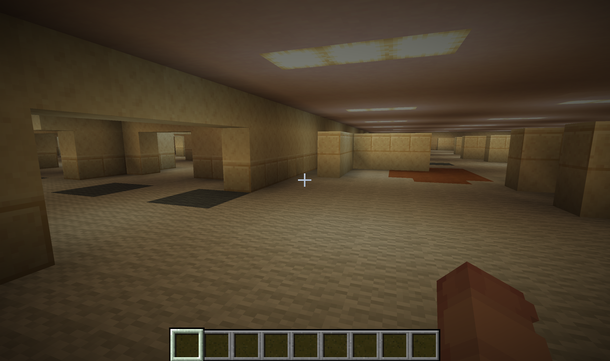
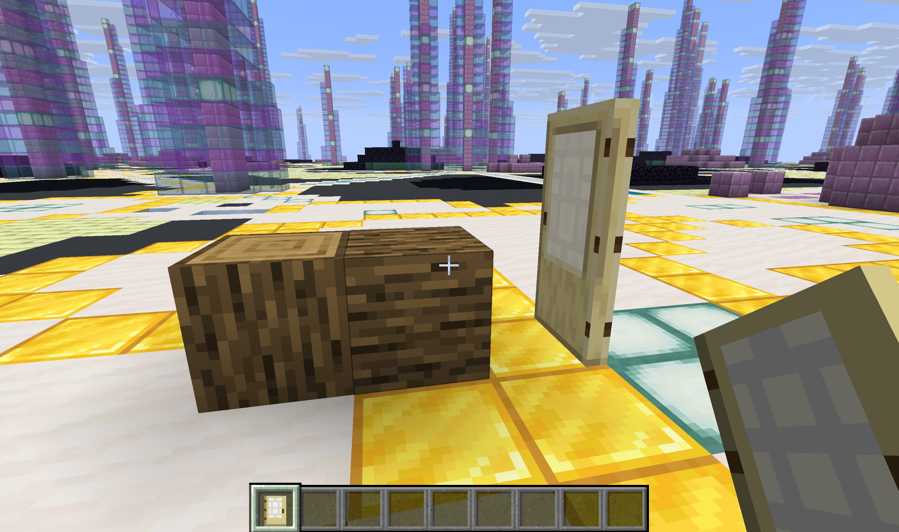
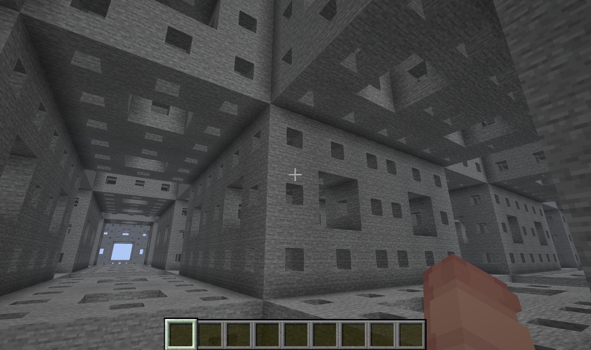
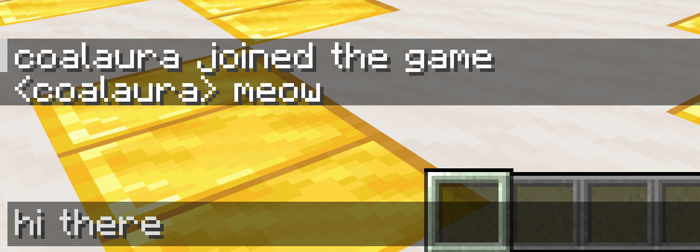

# minicraft

Minicraft is a small, fast Minecraft Java Edition server built in Go. It speaks the Minecraft protocol directly, without a vanilla server or JVM behind it and provides a focused foundation for experimenting with networking and procedural world generation.

Despite its small size, it implements enough of the protocol and game behavior to explore generated worlds with an unmodified client, including multiplayer, secure chat, chunk streaming, lighting, block interaction and full player inventory handling.

It currently targets **Minecraft Java Edition 1.21.11** (protocol 774).



## What works

- Online and offline authentication
- Secure player chat and multiplayer presence
- Player properties, including skins
- Chunk streaming with configurable render distance
- Player movement and synchronization
- Block breaking, placement and modification
- Stateful block placement for common structures such as slabs, stairs, doors, trapdoors, fences and walls
- Full player inventory and creative inventory interactions
- Biomes, lighting, world time and a day/night cycle
- Deterministic, seeded procedural world generation
- In-memory world modifications without world save files
- Transient chunk and player entity lifecycle
- TOML configuration

Minicraft is intentionally lightweight. It runs as a single Go binary and avoids the JVM, vanilla server internals and persistent world storage of a regular Minecraft server, making it especially quick to start and inexpensive to run.

<p align="center">
  
  
</p>



## Getting started

You will need Go 1.27 and a Minecraft Java Edition 1.21.11 client.

```sh
cp example.config.toml config.toml
go run .
```

Then connect to `localhost:25565`.

Edit `config.toml` to change the address, game mode, render distance, chat behavior, world settings and other server options.

To build a standalone binary instead:

```sh
go build -o minicraft .
./minicraft
```

## World generators

Set `world.generator` in `config.toml` to one of:

```text
babel
backrooms
fractal-vaults
menger-sponge
natural
quasicrystal
spawn-platform
wave-terrain
```

Generators are deterministic for a given seed and produce their worlds procedurally as chunks are requested. `spawn-platform` is the simplest example to start from, while the others demonstrate more complex and unusual generation techniques.

No persistent world storage is required: generated terrain can always be reconstructed from its generator and seed, while player modifications live only in memory.

## Development

Run the test suite with:

```sh
go test ./...
```

Minicraft is not intended to be a drop-in replacement for a full vanilla server. Its focus is on the Minecraft protocol, multiplayer fundamentals and providing a small, efficient foundation for procedural worlds.

There are still gameplay systems and protocol features that are intentionally incomplete or outside that scope.

## Todo

- Container inventories and interactions
- Basic command system
- Broader block placement and interaction support
- Block entities
- Chests and other inventory blocks
- Crafting
- Generic entity system
- Dropped items and item pickup
- Basic survival mechanics
- Adventure map features


## License

Minicraft is available under the [Mozilla Public License 2.0](LICENSE).
