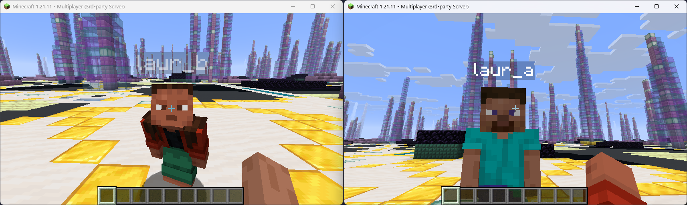

# minicraft

Minicraft is a small, fast Minecraft Java Edition server built in Go. It speaks the Minecraft protocol directly, without a vanilla server or JVM behind it and provides a focused foundation for experimenting with networking and procedural world generation.

Despite its small size, it implements enough of the protocol and game behavior to explore generated worlds with an unmodified client, including multiplayer, secure chat, chunk streaming, lighting, block interaction and full player inventory handling.

It currently targets **Minecraft Java Edition 1.21.11** (protocol 774).


## What works

- Online and offline authentication
- Secure player chat and multiplayer presence
- Player properties, including skins
- Chunk streaming with configurable render distance
- Player movement and synchronization
- Authoritative creative and timed survival block breaking with nearby crack animations
- Generated 1.21.11 block hardness, tool speed, harvest-gating and baseline ordinary-drop metadata
- Survival placement with exact main-hand/offhand item consumption and synchronized equipment
- Stateful block placement for common structures such as slabs, stairs, doors, trapdoors, fences and walls
- Full player inventory and creative inventory interactions
- Manual 2x2 and crafting-table recipes, including shaped, shapeless and ordinary crafting remainders
- Furnaces, smokers and blast furnaces with generated cooking recipes and fuel values, ticking, menus and synchronized progress
- Stateful barrels and single/double normal, trapped and copper chest variants, including container contents drops on removal
- Generic runtime entities, dropped items and item pickup
- Basic commands with client-side declarations and suggestions
- Biomes, lighting, world time and a day/night cycle
- Derived water and lava flow with active-chunk-paused scheduling, waterlogging, buckets and item fluid motion
- Deterministic, seeded procedural world generation
- In-memory world modifications without world save files
- Transient chunk and player entity lifecycle
- TOML configuration

Minicraft is intentionally lightweight. It runs as a single Go binary and avoids the JVM, vanilla server internals and persistent world storage of a regular Minecraft server, making it especially quick to start and inexpensive to run.



<p align="center">
  
  
</p>


## Getting started

You will need Go 1.27 and a Minecraft Java Edition 1.21.11 client.

```sh
cp example.config.toml config.toml
go run .
```

Then connect to `localhost:25565`.

Edit `config.toml` to change the address, game mode, render distance, chat behavior, world settings and other server options.

To build a standalone binary instead:

```sh
go build -o minicraft .
./minicraft
```

## World generators

Set `world.generator` in `config.toml` to one of:

```text
babel
backrooms
fractal-vaults
menger-sponge
natural
quasicrystal
spawn-platform
wave-terrain
```

Generators are deterministic for a given seed and produce their worlds procedurally as chunks are requested. `spawn-platform` is the simplest example to start from, while the others demonstrate more complex and unusual generation techniques.

No persistent world storage is required: generated terrain can always be reconstructed from its generator and seed, while player modifications live only in memory.

## Development

Run the test suite with:

```sh
go test ./...
```

Minicraft is not intended to be a drop-in replacement for a full vanilla server. Its focus is on the Minecraft protocol, multiplayer fundamentals, derived water and lava flow, and providing a small, efficient foundation for procedural worlds.

There are still gameplay systems and protocol features that are intentionally incomplete or outside that scope.

Fluid simulation covers derived water and lava flow, active-chunk-paused scheduled updates, waterlogging, buckets and item movement through fluids. Health and fire effects, Nether water evaporation and broader fluid parity remain deferred.

Generic block entities support procedural copy-on-write state, removal behavior and optional runtime interaction/ticking capabilities. Generic 9x1 through 9x6 storage menus are available, including barrels and single/double normal, trapped and copper chest variants. Furnace-family block entities process the generated 1.21.11 smelting, smoking and blasting catalogues with vanilla fuel durations, remainders, lit states and menu data. Manual crafting supports the generated ordinary shaped and shapeless recipe catalogue in the player inventory and at crafting tables. Recipe-book protocol, furnace XP payout, special/dynamic recipes and component-transforming recipes are not implemented yet.

The survival block loop uses server-tick-authoritative START, STOP and ABORT handling, vanilla baseline hardness/tool progress, harvest gating, cause-specific ordinary loot, and exact-hand placement consumption. Fixed baseline drops are generated where they can be represented faithfully. Silk Touch, Fortune, Efficiency, tool durability, XP drops, potion/effect modifiers, underwater and airborne mining penalties, and conditional or random loot tables remain explicitly deferred.

## Todo

- Broader block placement and interaction support
- Other inventory blocks
- Recipe-book and special crafting recipe parity
- Broader survival mechanics such as health, hunger, effects and tool durability
- Adventure map features


## License

Minicraft is available under the [Mozilla Public License 2.0](LICENSE).
